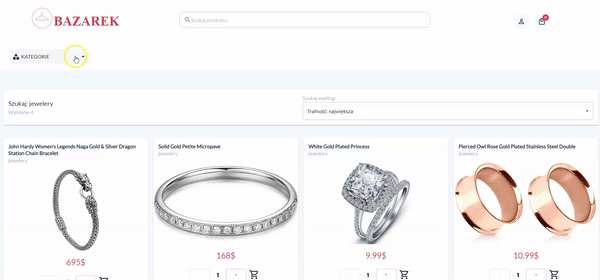
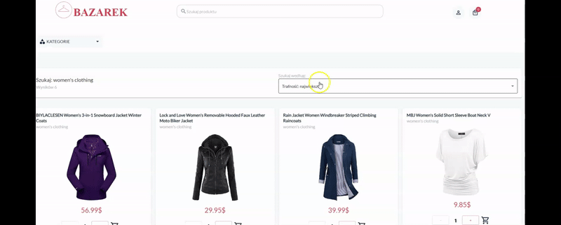
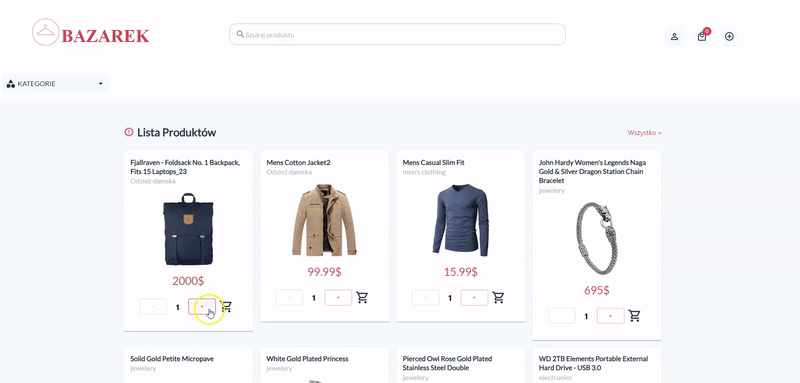
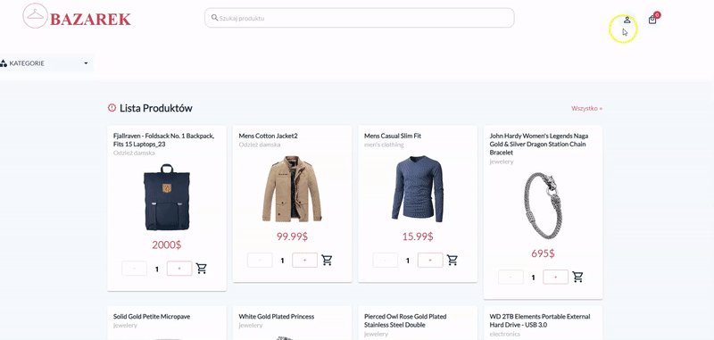

# To run app and server

npm run start

# Start Json.Server

npx json-server data/db.json -m ./node_modules/json-server-auth --port 8000

# This project is deployed in netlify

# <a href='https://react-buy-products.netlify.app/' target="_blank">Live</a>

---

<h2>Run project instruction</h2>

 install dependencies 'npm install'  and install separately concurrently , 'npm i concurrently'

It shows a products list, which is from json server 

The page has: 

<ol>
<li style="margin-bottom:20px;">Category list filter  

</li>
<li style="margin-bottom:20px;">Price filter  

</li>
<li style="margin-bottom:20px;">Add products to basket list and payment form    </li>
<li style="margin-bottom:20px;">Register form

</li>
<li>Login form   </li>
</ol>

